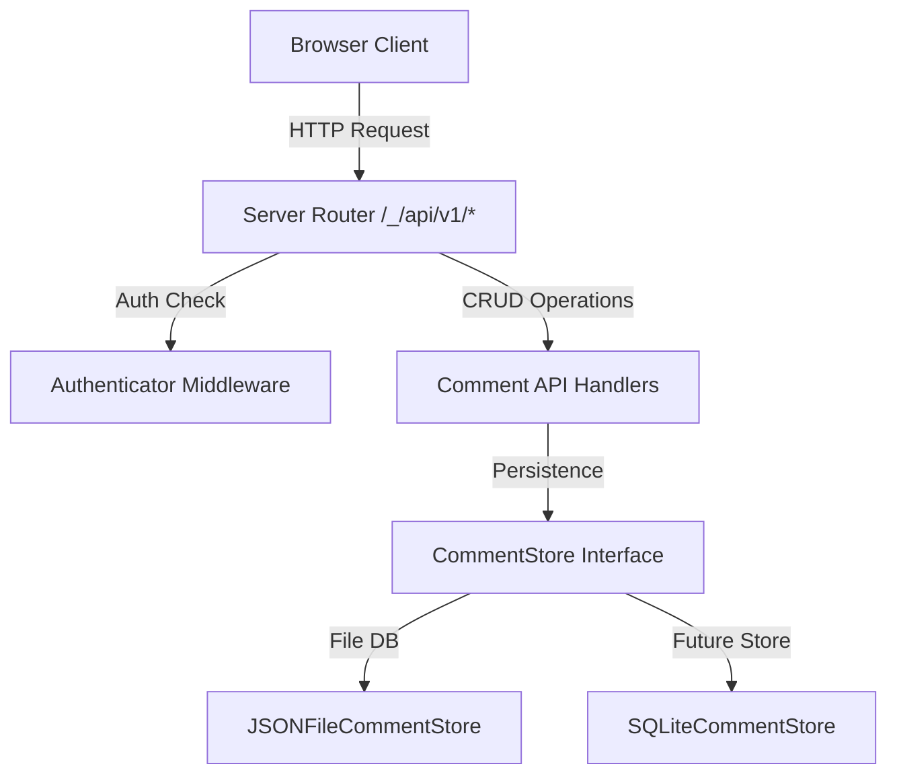
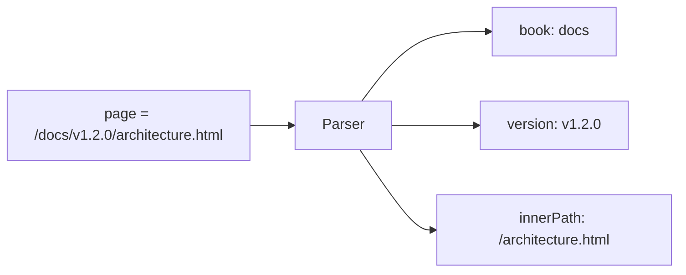
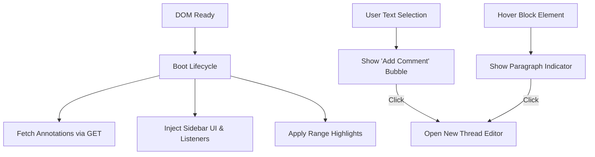

# Custom Comments API Design Document

This design document outlines the architecture, data structures, and implementation plan for adding a W3C Web Annotation-compliant commenting and annotation system to **Zipserver**.

---

## 1. Core Architecture

The commenting system is integrated directly into the Zipserver Go application. It introduces a database/storage abstraction (`CommentStore`) to manage comments persistently across local or cloud setups.



### 1.1 `CommentStore` Interface

To allow flexible deployment configurations, all persistence logic is hidden behind a clean interface:

```go
type CommentStore interface {
    GetComments(ctx context.Context, book, version, pagePath string) ([]Annotation, error)
    CreateComment(ctx context.Context, book, version, pagePath string, anno *Annotation) (*Annotation, error)
    UpdateComment(ctx context.Context, book, id string, updateFn func(*Annotation) error) (*Annotation, error)
    DeleteComment(ctx context.Context, book, id string, creatorID string) error
    GetPageForComment(id string) (book, version, pagePath string, found bool)
}
```

### 1.2 Storage Schema & File Organization

We isolate comments by book and version. We use a SHA-256 hash of the page path to index comment files inside version directories. This avoids special character escaping and path traversal security vulnerabilities:

*   **Directory Structure**: `comments/{book}/{version}/{page_path_hash}.json`
*   **Hash Function**: `Hex(SHA-256(CleanPath(pagePath)))`
*   **Concurrency**: Write-ahead locking utilizing standard Go mutexes (keyed by book and page path hash) to prevent race conditions during updates/deletes.

---

## 2. Multi-Book & Multi-Version Context

Zipserver operates on a `/{book}/{version}/{path}` scheme. We must extract these dimensions to support commenting properly.

### 2.1 URL Parsing Logic

When client requests are received with a `page` query parameter (or `target.source` in JSON bodies), the path is normalized:



*   **Version Resolution**: If `version` equals `"latest"`, it is resolved to the actual latest tag in storage via a 302 redirect. Therefore, comments are always queried and stored under their actual version.
*   **Version Isolation**: Comments are strictly bound to the specific version they were created on. This isolates discussions between different document releases (e.g. different git commits).

---

## 3. Data Schema (W3C Web Annotation Compliance)

Annotations conform to the **W3C Web Annotation Data Model** (JSON-LD).

### 3.1 Go Struct Definitions

```go
type Creator struct {
    ID     string `json:"id"`
    Type   string `json:"type"` // "Person"
    Name   string `json:"name"`
    Avatar string `json:"avatar"`
}

type TextualBody struct {
    Type   string `json:"type"` // "TextualBody"
    Value  string `json:"value"`
    Format string `json:"format"` // "text/markdown"
}

type Selector struct {
    Type   string `json:"type"` // "TextQuoteSelector", "TextPositionSelector", "FragmentSelector"
    Exact  string `json:"exact,omitempty"`
    Prefix string `json:"prefix,omitempty"`
    Suffix string `json:"suffix,omitempty"`
    Start  int    `json:"start,omitempty"`
    End    int    `json:"end,omitempty"`
    Value  string `json:"value,omitempty"`
}

type TargetObject struct {
    Source   string     `json:"source"`
    Selector []Selector `json:"selector,omitempty"`
}

type Target struct {
    Object *TargetObject
    String string
}

type Annotation struct {
    Context    string       `json:"@context"`
    ID         string       `json:"id"`
    Type       string       `json:"type"` // "Annotation"
    Created    string       `json:"created"`
    Modified   string       `json:"modified"`
    Creator    Creator      `json:"creator"`
    Body       TextualBody  `json:"body"`
    Target     Target       `json:"target"`
    Motivation string       `json:"motivation,omitempty"` // "replying" for replies
    Resolved   *bool        `json:"resolved,omitempty"`
    
    // Internal metadata (not returned to client, or filtered out)
    Book       string       `json:"book,omitempty"`
    Page       string       `json:"page,omitempty"`
    Version    string       `json:"version_created,omitempty"`
}
```

---

## 4. Authentication Integration & Updates

Existing Google OAuth is updated to extract additional profile fields and save them to the session.

### 4.1 Profile Fields Update

During Google OAuth callback, fetch the full profile:

```go
var googleUser struct {
    ID      string `json:"id"`
    Email   string `json:"email"`
    Name    string `json:"name"`
    Picture string `json:"picture"`
}
```

Save fields in the session:
*   `session.Values["user_id"] = "usr_" + googleUser.ID`
*   `session.Values["user_name"] = googleUser.Name`
*   `session.Values["avatar_url"] = googleUser.Picture`

### 4.2 Endpoint Rules

| Endpoint | Authentication | Description |
|---|---|---|
| `GET /_/api/v1/auth/me` | Public | Returns user details or `authenticated: false`. |
| `GET /_/login` | Public | Initiates OAuth flow, preserves redirect URL in session. |
| `GET /_/logout` | Public | Invalidates session cookie, redirects back. |
| `GET /_/api/v1/comments` | Public / Session | Fetch annotations for a page. |
| `POST /_/api/v1/comments` | Session Required | Creates annotation or reply. |
| `PATCH /_/api/v1/comments/{id}` | Session Required | Updates body or resolved state. |
| `DELETE /_/api/v1/comments/{id}` | Session Required | Cascades delete if matching creator ID. |

---

## 5. Implementation Phases

1.  **Phase 1**: Update `internal/auth` to capture Google profiles and support `/api/v1/auth/*` endpoints.
2.  **Phase 2**: Define data models and implement `JSONFileCommentStore` for page-level CRUD.
3.  **Phase 3**: Write tests validating thread replies, cascading deletion, and multi-version parsing.
4.  **Phase 4**: Wire up routes in `main.go`.

---

## 6. Frontend Comments Engine (`comments.js`)

The client-side commenting engine is built as an IIFE (Immediately Invoked Function Expression) to avoid global namespace pollution, executing automatically upon DOM completion.

### 6.1 Architecture Overview



### 6.2 Key Architectural Components

1.  **`CommentsAPI` Client Wrapper**:
    An asynchronous JavaScript utility class interfacing with Zipserver REST endpoints (`GET`, `POST`, `PATCH`, `DELETE` operations mapped to `/_/api/v1/comments/*`).

2.  **Anchor Selection Engine**:
    To robustly preserve annotations across content updates, target elements are referenced dynamically:
    -   **Multi-Stage Fallback Selector**: Looks up block elements using a sequence of matches:
        1.  Exact index check matching the stored paragraph SHA-256 hash.
        2.  Global DOM scan matching the SHA-256 hash.
        3.  Index check matching the tagName.
        4.  Neighborhood scan (offsets $\pm 5$ blocks) searching for matching tagName.
        5.  Global DOM scan fallback for tagName.
    -   **TreeWalker Offsets**: Tracks precise range positions within block nodes utilizing standard `document.createTreeWalker` to sum up character lengths across nested text nodes safely.

3.  **In-Page Highlighting Loader**:
    -   Integrated with `mark.js` (distributed with mdbook) to handle sub-string range selections.
    -   Applies distinct styling classes: `.comment-highlight` (default active highlights) and `.resolved-highlight` (unobtrusive gray styling for resolved threads).
    -   Serves block-level annotations by applying `.comment-section-highlight` directly to structural block containers.

4.  **Dynamic Sliding Sidebar Drawer**:
    -   Injects a sliding panel (`.comment-sidebar`) that pushes the mdbook wrapper to the left, scaling down for small screens using responsive media queries.
    -   Implements event propagation isolation (`e.stopPropagation()`) on keypress listeners to prevent active mdbook global keyboard shortcut mappings (like arrow navigation or `?` shortcut panels) while typing inside input areas.

